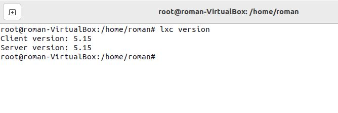

# Урок 2. Механизмы контрольных групп
## Classwork
Знакомились с работой LXC
## Homework
### Задание 1:
1) запустить контейнер с ubuntu, используя механизм LXC;
2) ограничить контейнер 256 Мб ОЗУ и проверить, что ограничение работает;
3) добавить автозапуск контейнеру, перезагрузить ОС и убедиться, что контейнер действительно запустился самостоятельно;
4) при создании указать файл, куда записывать логи;
5) после перезагрузки проанализировать логи.

**Решение**

* Установим LXC и шаблоны:
```
sudo apt install lxc lxc-templates uidmap
```

Затем командой "$ lxc version" проверяем установленную версию. Видим как система подсказывает, что для начала необходимо 
инициализировать LXD на машине. Вводим команду:
```
lxd init
```

После инициализации снова убеждаемся, что все нормально установлено, путем проверки версии LXC:
```
lxc version
```



* Следующей командой создаем новый контейнер с именем test1 и задаем путь для файла конфигурации:
```
lxc-create -n test1 -t ubuntu -f /usr/share/doc/lxc/lxc-veth.conf 
```

Видим большое количество текста, значит команда введена правильно. В тексте указана ошибка открытия файла конфигурации 
указанного нами. На запуск контейнера это не повлияет, а случается из-за того, что такого файла на данном этапе не существует.


После того как контейнер установился мы видим следующий текст (установка прошла быстро т.к. делал это многократно):


Система оповещает нас о том, что контейнер создан, у него заданы стандартные параметры (логин: ubuntu, пароль: ubuntu).


* Теперь необходимо запустить созданный нами контейнер. Для этого вводим следующую команду:
```
sudo lxc-start -d -n test1
```


Если система никак не оповестила нас ни о чем, значит команда успешно выполнена. Проверить это можно, например, путем 
входа в контейнер:
```
sudo lxc-attach -n test1
```

Видим, что мы зашли в test1 под root.


* Вводим следующую команду для просмотра выделенной и свободной памяти:
```
free -m
```


Для удобства сразу перейдем в нужную папку:
```
cd sys/fs/cgroup
```

Считываем данные из файла, в котором ограничивается потребление памяти контейнером:
```
cat memory.max
```
Здесь мы можем наблюдать, что ограничение памяти установлено на максимальное значение.


Далее выполним это же из папки .lxc:


Убеждаемся в максимальном значении. Выходим из контейнера:
```
exit
```


Для того, что бы ограничить потребление памяти контейнером, необходимо добавить строку в файл конфигурации. 
Для начала считаем информацию из него и убедимся, что ограничений командой там нет:
```
sudo cat /var/lib/lxc/test1/config
```


После этого любым удобным редактором (я делал через редактор nano) добавляем в этот файл конфигурации вниз текста 
следующую строку:

```
lxc.cgroup2.memory.max = 256M
```


Таким образом мы ограничили потребление памяти не более 256 мб.
Останавливаем контейнер и снова запускаем его.
Вводим следующую команду, что бы убедиться, что ограничение работает:
```
sudo cat /sys/fs/cgroup/lxc.payload.test1/memory.max
```


Как мы видим, система пересчитала и выдала результат, где много цифр. Не пугаемся, это значение примерно равно 256 мб.


* Далее просмотрим список имеющихся в нашей системе контейнеров:
```
sudo lxc-ls -f
```
 У нас имеется один контейнер test1, он запущен и в автозапуске стоит 0 (что означает, что автозапуск контейнера отключен).
 Нам необходимо включить автозапуск, для этого открываем файл конфигурации в редакторе nano:
```
sudo nano /var/lib/lxc/test1/config
```


Добавляем в конец текста файла конфигурации следующую строку:
```
lxc.start.auto = 1
```

Сохраняем, закрываем редактор и перезагружаем систему, например командой '$ reboot'.


После перезагрузки снова выполняем команду:

```
sudo lxc-ls -f
```

Вводим пароль root и убеждаемся, что контейнер запущен и автозапуск включен.


* При запуске контейнера можно в параметрах команды указать, где хранить логи, например:
```
lxc-start -n test1 --logfile log.log
```


* Для удаления контейнера необходимо воспользоваться следующей командой:
```
lxc-destroy -n test1
```
### Задание 2*: 
Настроить автоматическую маршрутизацию между контейнерами. Адреса можно взять: 10.0.12.0/24 и 10.0.13.0/24.
Задание со звездочкой - повышенной сложности, это нужно учесть при выполнении (но сделать его необходимо).

**Решение**
1) Создадим второй контейнер test2 (аналогично test1).
2) В файле конфигурации test1 прописываем общею настройку сети + настройку связи контейнеров (выделено красным):


3) Аналогично проделываем для test2 (сети взяты из семинара, но можно было найти их в дефолтных папках):


4) Проверяем соединение контейнеров по ip адресу 10.0.0.10 (не проваливаясь в контейнер). Пинг не прошел т.к. этот 
адрес прописан для соединения контейнеров, а не для соединения с родительской машиной (необходимо проваливаться в контейнер).


5) Проверяем соединение контейнера с внешней машиной по ip 10.0.3.153. Пинг прошел. Соединение установлено.


6) Проваливаемся в контейнер test1 и проверяем соединение контейнеров по ip адресу 10.0.0.20. Пинг прошел. Соединение 
установлено.


Таким образом мы наладили маршрутизацию между контейнерами и проверили соединение с родительской машиной.

*Подготовил студент GeekBrains* [**`Костиков Роман`**](https://gb.ru/users/d0da3e74-94c9-4467-a23e-2ee70d85dcdc), Seminar_2_containerization
